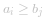
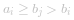
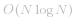
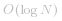

 [image.png](https://pic.leetcode-cn.com/ee740d492676a26ff7017dd1635ff3af0361ee412f0e1c7bf2ffee032e3dfb4e-image.png)


首先，需要对「子序列」和「子串」这两个概念进行区分；

+ 子序列（subsequence）

子序列并不要求连续，例如：序列 `[4, 6, 5]` 是 `[1, 2, 4, 3, 7, 6, 5]` 的一个子序列。


+ 子串（substring、subarray）

子串一定是连续的，例如：「力扣」第 3 题：[“无重复字符的最长子串”](https://leetcode-cn.com/problems/longest-substring-without-repeating-characters/)，「力扣」第 53 题：[“最大子序和”](https://leetcode-cn.com/problems/maximum-subarray/)。

其次，题目中的「上升」的意思是「严格上升」，`[1, 2, 2, 3]` 都不能算作「上升子序列」；

第三，子序列中元素的相对顺序很重要。

**它们必须保持在原始数组中的相对顺序**。如果把这个限制去掉，将原始数组去重以后，元素的个数即为所求。

<br>

---
<br>


### 方法一：暴力解法

+ 使用「回溯搜索算法」或者「位运算」的技巧，可以得到输入数组的所有子序列，时间复杂度为 *O(2^N)*；
+ 再对这些子串再依次判定是否为「严格上升」，时间复杂度 为*O(N)*，所以总的时间复杂度为：*O(N2^N)*。

---

这道题是很经典的使用「动态规划」算法解决的问题。


「动态规划」的基本思想是：

> 从一个小问题出发（「动态」这个词的意思的意思），通过「状态转移」，并且逐步记录求解问题的过程（「规划」这个词的意思，就是「打表格」，以「以空间换时间」），逐步得到所求规模的问题的解。

对于这道题来说，就是一个数一个数地去考虑（区别于递归的写法，直接面对问题求解）。

---


### 方法二：动态规划

+ 首先考虑题目问什么，就把什么定义成状态。

+ 题目问最长上升子序列的长度，其实可以把「子序列的长度」定义成状态，但是发现「状态转移」不好做；
+ 把「子序列的长度」定义成状态，事实上也可以，只是目前这样定义状态，**没有定义得很清晰**，具体做法在下文「方法三」；

+ 为了从一个较短的上升子序列得到一个较长的上升子序列，我们主要关心这个较短的上升子序列结尾的元素。由于要保证子序列的相对顺序，在程序读到一个新的数的时候，如果比已经得到的子序列的最后一个数还大，那么就可以放在这个子序列的最后，形成一个更长的子序列；

于是我们可以这样定义状态：


#### 第 1 步：定义状态

由于一个子序列一定会以一个数结尾，于是将状态定义成：`dp[i]` 表示**以 `nums[i]` 结尾**的「上升子序列」的长度。注意：这个定义中 **`nums[i]` 必须被选取，且必须是这个子序列的最后一个元素**。


#### 第 2 步：考虑状态转移方程

+ 遍历到 `nums[i]` 时，需要把下标 `i` 之前的所有的数都看一遍；
+ 只要 `nums[i]` 严格大于在它位置之前的某个数，那么 `nums[i]` 就可以接在这个数后面形成一个更长的上升子序列；
+ 因此，`dp[i]` 就等于下标 `i` 之前**严格**小于 `nums[i]` 的状态值的最大者 *+1*。

语言描述：在下标 `i` 之前严格小于 `nums[i]` 的所有状态值中的最大者 *+ 1*。


符号描述：

![dp\[i\]=\max_{0\lej<i,nums\[j\]<nums\[i\]}{dp\[j\]+1} ](./p___dp_i__=_max_{0_le_j___i,_nums_j____nums_i_}_{dp_j__+_1}__.png) 


#### 第 3 步：考虑初始化

+ `dp[i] = 1`，*1* 个字符显然是长度为 *1* 的上升子序列。


#### 第 4 步：考虑输出


+ 这里要注意，不能返回最后一个状态值；
+ 还是根据定义，最后一个状态值只是以 `nums[len - 1]` 结尾的「上升子序列」的长度；
+ 状态数组 `dp` 的最大值才是最后要输出的值。


![\max_{1\lei\leN}dp\[i\] ](./p___max_{1_le_i_le_N}_dp_i___.png) 

### 第 5 步：考虑状态压缩。


+ 遍历到一个新数的时候，之前所有的状态值都得保留，因此无法压缩。


看下面的例子理解「动态规划」的执行流程。

提示：由于幻灯片上的文字比较多，可以先让幻灯片动起来，从整体把握思想。


  [300-dp-1.png](https://pic.leetcode-cn.com/9681bb5aa5712f0ca6bb577ca0d21df805f72f6b3b5b95c3d5340801118d5683-300-dp-1.png)  [300-dp-2.png](https://pic.leetcode-cn.com/158c37377e1e3efbb0cba7858187a9d66428ef991c5f05c59e3a7dab6b509436-300-dp-2.png)  [300-dp-3.png](https://pic.leetcode-cn.com/92d5014ce051b31aff242f10c7d9735e6e3b6e35f567e9a2663ce04075390d3d-300-dp-3.png)  [300-dp-4.png](https://pic.leetcode-cn.com/30739cd98770a4ca9e02a78971a23b5d1030d0b5135223cc419045a2dabdaecb-300-dp-4.png)  [300-dp-5.png](https://pic.leetcode-cn.com/a9d0dd0c2e1292d466f86f7fa980bf854bc9a0be0f90720a7d9823ba532becf9-300-dp-5.png)  [300-dp-6.png](https://pic.leetcode-cn.com/fdb3efd26dd0972f65ad7c3a5ac53022b8d43954f31919403d4cd2ef48ac8d67-300-dp-6.png)  [300-dp-7.png](https://pic.leetcode-cn.com/a495f476c50e8dbbc20b76cec1e97454e060b9fbfae4a12e205b87ea75ae0bdc-300-dp-7.png)  [300-dp-8.png](https://pic.leetcode-cn.com/2ca152b9864efd08d1c3d030f2544d794ac6d26deff3bfd451c8fd0d67f88799-300-dp-8.png)  [300-dp-9.png](https://pic.leetcode-cn.com/53e09c8ad0fb0c8d9fa1954222228b834ad5cbdb531e2efc06230b574873a122-300-dp-9.png)  [300-dp-10.png](https://pic.leetcode-cn.com/fe7d46471345771c83c5675fb3deb07efea784d206e964befea4b5413eea3392-300-dp-10.png) 


**参考代码 1**：

```Java []
import java.util.Arrays;

public class Solution {

    public int lengthOfLIS(int[] nums) {
        int len = nums.length;
        if (len < 2) {
            return len;
        }

        int[] dp = new int[len];
        Arrays.fill(dp, 1);

        for (int i = 1; i < len; i++) {
            for (int j = 0; j < i; j++) {
                if (nums[j] < nums[i]) {
                    dp[i] = Math.max(dp[i], dp[j] + 1);
                }
            }
        }

        int res = 0;
        for (int i = 0; i < len; i++) {
            res = Math.max(res, dp[i]);
        }
        return res;
    }
}
```

**复杂度分析：**

+ 时间复杂度：*O(N^2)*，这里 *N* 是数组的长度，我们写了两个 `for` 循环，每个 `for` 循环的时间复杂度都是线性的。
+ 空间复杂度：*O(N)*，要使用和输入数组长度相等的状态数组，因此空间复杂度是 *O(N)*。

这个「动态规划」的方法在计算一个新的状态的时候，需要考虑到之前所有小于 `nums[i]` 的那些位置的状态。

事实上，这个算法还有改进的空间。我们是从「状态」的定义开始考虑的。


### 方法二：修改状态定义（同时用到了贪心算法、二分查找）

+ 依然是着眼于一个上升子序列的**结尾的元素**；
+ **如果已经得到的上升子序列的结尾的数越小，遍历的时候后面接上一个数，就会有更大的可能性构成一个更长的上升子序列**；
+ 既然结尾越小越好，我们可以记录**在长度固定的情况下，结尾最小的那个元素的数值**，这样定义也是为了方便得到「状态转移方程」。

为了与之前的状态区分，这里将状态数组命名为 `tail`。


#### 第 1 步：定义新状态（特别重要）

**`tail[i]` 表示长度为 `i + 1` 的**所有**上升子序列的结尾的最小值。**


说明：

+ `tail[0]` 表示长度为 *1* 的所有上升子序列中，结尾最小的那个元素的数值，以题目中的示例为例 `[10, 9, 2, 5, 3, 7, 101, 18]` 中，容易发现长度为 `2` 的**所有**上升子序列中，结尾最小的是子序列 `[2, 3]` ，因此 `tail[1] = 3`
+ 下标和长度有一个 `1` 的偏差；


状态定义其实也描述了状态转移方程。

#### 第 2 步：思考状态转移方程

从直觉上看，数组 `tail` 也是一个严格上升数组。我们需要证明一下。

---

**证明**：即对于任意的下标 `0 <= i < j < len` ，都有 `tail[i] < tail[j]`。

（使用反证法）

假设对于任意的下标 `i` < `j` ，存在某个 `tail[i] >= tail[j]`。

对于此处的 `tail[i]` 而言，对应一个上升子序列 *[a_0, a_1, ..., a_i]*，依据定义 *tail[i] = a_i*；
对于此处的 `tail[j]` 而言，对应一个上升子序列 *[b_0, b_1, ..., b_i, ... , b_j]*，依据定义 *tail[j] = b_j*；

由于  `tail[i] >= tail[j]`，等价于  。而在上升子序列 *[b_0, b_1, ..., b_i, ... , b_j]* 中，*b_i* 严格小于 *b_j*，故有  ，则上升子序列 *[b_0, b_1, ..., b_i]* 是一个长度也为 `i + 1` 但是结尾更小的数组，与 *a_i* 的最小性矛盾。

因此原命题成立。（证完）

---

我们只需要维护状态数组 `tail` 的定义，它的长度就是最长上升子序列的长度。

下面说明如何在遍历中，如何维护状态数组 `tail` 的定义：

#### 算法的执行流程

1、设置一个数组 `tail`，初始时为空；

注意：**数组 `tail` 虽然是有序数组，但它不是问题中的「最长上升子序列」**（下文还会强调），不能命名为 `LIS`。有序数组 `tail` 只是用于求解 `LIS` 问题的辅助数组。

2、在遍历数组 `nums` 的过程中，每来一个新数 `num`，如果这个数**严格**大于有序数组 `tail` 的最后一个元素，就把 `num` 放在有序数组 `tail` 的后面，否则进入第 3 点；

> 注意：这里的大于是「严格大于」，不包括等于的情况。

3、在有序数组 `tail` 中查找第 1 个等于大于 `num` 的那个数，试图让它变小；

+ 如果有序数组 `tail` 中存在**等于** `num` 的元素，什么都不做，因为以 `num` 结尾的最短的「上升子序列」已经存在；
+ 如果有序数组 `tail` 中存在**大于** `num` 的元素，找到第 1 个，让它变小，这样我们就找到了一个**结尾更小**的**相同长度**的上升子序列。

说明：我们再看一下数组 `tail[i]` 的定义：长度为 `i + 1` 的**所有**最长上升子序列的结尾的最小值。因此，在遍历的过程中，我们试图让一个大的值变小是合理的。

这一步可以认为是「贪心算法」，总是做出在当前看来最好的选择，当前「最好的选择」是：当前只让让第 1 个严格大于 `nums[i]` 的数变小，变成 `nums[i]`，这一步操作是“无后效性”的。

由于是在有序数组中的操作，因此可以使用「二分查找算法」。

4、遍历新的数 `num` ，先尝试上述第 2 点，第 2 点行不通则执行第 3 点，直到遍历完整个数组 `nums`，最终**有序数组 `tail` 的长度，就是所求的“最长上升子序列”的长度**。


### 第 3 步：思考初始化

`dp[0] = nums[0]`，在只有 1 个元素的情况下，它当然是长度为 1 并且结尾最小的元素。

### 第 4 步：思考输出

数组 `tail` 的长度，上文其实也已经说了，还是依据定义，`tail[i]` 表示长度固定为 `i + 1` 的所有「上升子序列」的结尾元素中最小的那个，长度最多就是数组 `tail` 的长度。

### 第 5 步：思考状态压缩

无法压缩。

下面看一下这个算法在示例上的的执行流程，以加深体会，我在示例的数组后面加上了 `4`、`8`、`6`、`12`，依然是先让幻灯片动起来，看思想就好了。

  [300-greed-binary-search-1.png](https://pic.leetcode-cn.com/ecfe05bf65309a085484489b9dbf0d354ebd04254aa192ae08712dfe02dc2a0c-300-greed-binary-search-1.png)  [300-greed-binary-search-2.png](https://pic.leetcode-cn.com/f30cf9c7fee1577ea3cdab964198aabfd64e566801e7a2f671be1209fdbe93b7-300-greed-binary-search-2.png)  [300-greed-binary-search-3.png](https://pic.leetcode-cn.com/2ad160a3cb5cb5a9e6f305e7e4f373a4bcf9694364502ae18cfa42616fbc50f8-300-greed-binary-search-3.png)  [300-greed-binary-search-4.png](https://pic.leetcode-cn.com/462331c85f2cff24d7843e4d2d20b6cf053ec5a66090c300d6725bce35adffa0-300-greed-binary-search-4.png)  [300-greed-binary-search-5.png](https://pic.leetcode-cn.com/65eeee3079908c510ab18a58fc79a759bc990fc5f475ce11a4bd5703718fa297-300-greed-binary-search-5.png)  [300-greed-binary-search-6.png](https://pic.leetcode-cn.com/542301ec25d4b7c6ff5bfe2247b0c93ef0c8de2d6dcdd8d31de1fd76ca023dc6-300-greed-binary-search-6.png)  [300-greed-binary-search-7.png](https://pic.leetcode-cn.com/d25ebf30e65f08539631b99877fe3e680dc610174e480d3138316bd4b0fd4bb0-300-greed-binary-search-7.png)  [300-greed-binary-search-8.png](https://pic.leetcode-cn.com/d879eee3c8d23d24100c78191a11b2400de1c947fbaad664326d03a031406a3a-300-greed-binary-search-8.png)  [300-greed-binary-search-9.png](https://pic.leetcode-cn.com/7008940585efaf7e11f2b50539f654d38083eda3f4be4af9545f82499520117a-300-greed-binary-search-9.png)  [300-greed-binary-search-10.png](https://pic.leetcode-cn.com/fa286e2662037237697ee1487b66ebdd60cc4d43dea6c629736e5804d0c47502-300-greed-binary-search-10.png)  [300-greed-binary-search-11.png](https://pic.leetcode-cn.com/4ea79c933335d3589ea30d0069bc5f0d6370a4e1ccf7340ce36150707ed38d57-300-greed-binary-search-11.png)  [300-greed-binary-search-12.png](https://pic.leetcode-cn.com/1482b6fd5b6616b13dc2c2d7c58d20e0aedef555102e8d7201e66e6b080185ca-300-greed-binary-search-12.png)  [300-greed-binary-search-13.png](https://pic.leetcode-cn.com/66ed49450c9973febfa84fed76229bdc236a480f6554741519f9f22cec033539-300-greed-binary-search-13.png)  [300-greed-binary-search-14.png](https://pic.leetcode-cn.com/df18b7a8889e28ec2c0a11a89385f0814d034bb0d3caf95d242e41683a5f382c-300-greed-binary-search-14.png)  [300-greed-binary-search-15.png](https://pic.leetcode-cn.com/09cc26acbdc0fe62ec9a79d95d0bb878c0abd8b2af61f7330098ac1b7ddf8e42-300-greed-binary-search-15.png)  [300-greed-binary-search-16.png](https://pic.leetcode-cn.com/5affa5e17cdbb96e7bdd4659cb8553d64727ee895383629c4d927dd80fc6fefa-300-greed-binary-search-16.png)  [300-greed-binary-search-17.png](https://pic.leetcode-cn.com/1805c1d89a77358fbaba1419d86c7c489afd857c6afd817d657c0bd1e200aa86-300-greed-binary-search-17.png)  [300-greed-binary-search-18.png](https://pic.leetcode-cn.com/20b8de5654fff413a00c1d7bd3204a4930731d0b342dbc2ba4cfa41c89f6a6a3-300-greed-binary-search-18.png)  [300-greed-binary-search-19.png](https://pic.leetcode-cn.com/677a66d92579ced1b67c114c90f1dafb499bd2dd198b93acc440d18e32ede7f1-300-greed-binary-search-19.png)  [300-greed-binary-search-20.png](https://pic.leetcode-cn.com/39eb82360d5ad5314e1f649a267c821cca8a5b7f1a705d9985596bb423a2487e-300-greed-binary-search-20.png)  [300-greed-binary-search-21.png](https://pic.leetcode-cn.com/fb069e6f4e36257acf00dbce1bc832002ce68289016b57aa0b2ac0b1f0150a77-300-greed-binary-search-21.png) 

说明：关于如何使用二分查找法，请参考「力扣」第 35 题：“插入元素的位置”的 [题解](https://leetcode-cn.com/problems/search-insert-position/solution/te-bie-hao-yong-de-er-fen-cha-fa-fa-mo-ban-python-/) 。


**参考代码 3**：严格按照以上算法执行流程写出来的代码

```Java []
public class Solution {
    public int lengthOfLIS(int[] nums) {
        int len = nums.length;
        if (len <= 1) {
            return len;
        }

        // tail 数组的定义：长度为 i + 1 的上升子序列的末尾最小是几
        int[] tail = new int[len];
        // 遍历第 1 个数，直接放在有序数组 tail 的开头
        tail[0] = nums[0];
        // end 表示有序数组 tail 的最后一个已经赋值元素的索引
        int end = 0;

        for (int i = 1; i < len; i++) {
            // 【逻辑 1】比 tail 数组实际有效的末尾的那个元素还大
            if (nums[i] > tail[end]) {
                // 直接添加在那个元素的后面，所以 end 先加 1
                end++;
                tail[end] = nums[i];
            } else {
                // 使用二分查找法，在有序数组 tail 中
                // 找到第 1 个大于等于 nums[i] 的元素，尝试让那个元素更小
                int left = 0;
                int right = end;
                while (left < right) {
                    // 选左中位数不是偶然，而是有原因的，原因请见 LeetCode 第 35 题题解
                    // int mid = left + (right - left) / 2;
                    int mid = left + ((right - left) >>> 1);
                    if (tail[mid] < nums[i]) {
                        // 中位数肯定不是要找的数，把它写在分支的前面
                        left = mid + 1;
                    } else {
                        right = mid;
                    }
                }
                // 走到这里是因为 【逻辑 1】 的反面，因此一定能找到第 1 个大于等于 nums[i] 的元素
                // 因此，无需再单独判断
                tail[left] = nums[i];
            }
            // 调试方法
            // printArray(nums[i], tail);
        }
        // 此时 end 是有序数组 tail 最后一个元素的索引
        // 题目要求返回的是长度，因此 +1 后返回
        end++;
        return end;
    }

    // 调试方法，以观察是否运行正确
    private void printArray(int num, int[] tail) {
        System.out.print("当前数字：" + num);
        System.out.print("\t当前 tail 数组：");
        int len = tail.length;
        for (int i = 0; i < len; i++) {
            if (tail[i] == 0) {
                break;
            }
            System.out.print(tail[i] + ", ");
        }
        System.out.println();
    }

    public static void main(String[] args) {
        int[] nums = new int[]{3, 5, 6, 2, 5, 4, 19, 5, 6, 7, 12};
        Solution solution = new Solution8();
        int lengthOfLIS = solution8.lengthOfLIS(nums);
        System.out.println("最长上升子序列的长度：" + lengthOfLIS);
    }
}
```
```Python []
from typing import List


class Solution:
    def lengthOfLIS(self, nums: List[int]) -> int:
        size = len(nums)
        # 特判
        if size < 2:
            return size

        # 为了防止后序逻辑发生数组索引越界，先把第 1 个数放进去
        tail = [nums[0]]
        for i in range(1, size):
            # 【逻辑 1】比 tail 数组实际有效的末尾的那个元素还大
            # 先尝试是否可以接在末尾
            if nums[i] > tail[-1]:
                tail.append(nums[i])
                continue

            # 使用二分查找法，在有序数组 tail 中
            # 找到第 1 个大于等于 nums[i] 的元素，尝试让那个元素更小
            left = 0
            right = len(tail) - 1
            while left < right:
                # 选左中位数不是偶然，而是有原因的，原因请见 LeetCode 第 35 题题解
                # mid = left + (right - left) // 2
                mid = (left + right) >> 1
                if tail[mid] < nums[i]:
                    # 中位数肯定不是要找的数，把它写在分支的前面
                    left = mid + 1
                else:
                    right = mid
            # 走到这里是因为【逻辑 1】的反面，因此一定能找到第 1 个大于等于 nums[i] 的元素，因此无需再单独判断
            tail[left] = nums[i]
        return len(tail)
```
```C++ []
#include <iostream>
#include <vector>

using namespace std;

class Solution {
public:
    int lengthOfLIS(vector<int> &nums) {
        int len = nums.size();
        if (len < 2) {
            return len;
        }

        vector<int> tail;
        tail.push_back(nums[0]);
        // tail 结尾的那个索引
        int end = 0;

        for (int i = 1; i < len; ++i) {
            if (nums[i] > tail[end]) {
                tail.push_back(nums[i]);
                end++;
            } else {
                int left = 0;
                int right = end;
                while (left < right) {
                    int mid = (left + right) >> 1;
                    if (tail[mid] < nums[i]) {
                        left = mid + 1;
                    } else {
                        right = mid;
                    }
                }
                tail[left] = nums[i];
            }
        }
        return end + 1;
    }
};
```


**复杂度分析**：

+ 时间复杂度： ，遍历数组使用了 *O(N)*，二分查找法使用了  。
+ 空间复杂度：*O(N)*，开辟有序数组 `tail` 的空间至多和原始数组一样。

**参考代码 4**：与「参考代码 3」等价的代码，区别仅在于「二分查找法」候选区间的选择

```Java []
public class Solution {

    public int lengthOfLIS(int[] nums) {
        int len = nums.length;
        if (len <= 1) {
            return len;
        }

        // tail 数组的定义：长度为 i + 1 的上升子序列的末尾最小是几
        int[] tail = new int[len];
        // 遍历第 1 个数，直接放在有序数组 tail 的开头
        tail[0] = nums[0];

        // end 表示有序数组 tail 的最后一个已经赋值元素的索引
        int end = 0;

        for (int i = 1; i < len; i++) {
            int left = 0;
            // 这里，因为当前遍历的数，有可能比有序数组 tail 数组实际有效的末尾的那个元素还大
            // 【逻辑 1】因此 end + 1 应该落在候选区间里
            int right = end + 1;
            while (left < right) {
                // 选左中位数不是偶然，而是有原因的，原因请见 LeetCode 第 35 题题解
                // int mid = left + (right - left) / 2;
                int mid = (left + right) >>> 1;

                if (tail[mid] < nums[i]) {
                    // 中位数肯定不是要找的数，把它写在分支的前面
                    left = mid + 1;
                } else {
                    right = mid;
                }
            }
            // 因为 【逻辑 1】，因此一定能找到第 1 个大于等于 nums[i] 的元素
            // 因此，无需再单独判断，直接更新即可
            tail[left] = nums[i];

            // 但是 end 的值，需要更新，当前仅当更新位置在当前 end 的下一位
            if (left == end + 1) {
                end++;
            }

        }
        // 调试方法
        // printArray(nums[i], tail);
        // 此时 end 是有序数组 tail 最后一个元素的索引
        // 题目要求返回的是长度，因此 +1 后返回
        end++;
        return end;
    }

    // 调试方法，以观察是否运行正确
    private void printArray(int num, int[] tail) {
        System.out.print("当前数字：" + num);
        System.out.print("\t当前 tail 数组：");
        int len = tail.length;
        for (int i = 0; i < len; i++) {
            if (tail[i] == 0) {
                break;
            }
            System.out.print(tail[i] + ", ");
        }
        System.out.println();
    }

    public static void main(String[] args) {
        int[] nums = new int[]{3, 5, 6, 2, 5, 4, 19, 5, 6, 7, 12};
        Solution solution = new Solution();
        int lengthOfLIS = solution.lengthOfLIS(nums);
        System.out.println("最长上升子序列的长度：" + lengthOfLIS);
    }
}
```
```Python []
from typing import List


class Solution:

    def lengthOfLIS(self, nums: List[int]) -> int:
        size = len(nums)
        # 特判
        if size < 2:
            return size
        # tail 数组的定义：长度为 i + 1 的上升子序列的末尾最小是几
        # 遍历第 1 个数，直接放在有序数组 tail 的开头
        tail = [nums[0]]

        for i in range(1, size):
            # 找到大于等于 num 的第 1 个数，试图让它变小
            left = 0
            # 因为有可能 num 比 tail 数组中的最后一个元素还要大，
            # 【逻辑 1】所以右边界应该设置为 tail 数组的长度
            right = len(tail)
            while left < right:
                # 选左中位数不是偶然，而是有原因的，原因请见 LeetCode 第 35 题题解
                # mid = left + (right - left) // 2
                mid = (left + right) >> 1

                if tail[mid] < nums[i]:
                    # 中位数肯定不是要找的数，把它写在分支的前面
                    left = mid + 1
                else:
                    right = mid
            if left == len(tail):
                tail.append(nums[i])
            else:
                # 因为【逻辑 1】，因此一定能找到第 1 个大于等于 nums[i] 的元素，因此无需再单独判断，直接更新即可
                tail[left] = nums[i]
        return len(tail)
```
```C++ []
#include <iostream>
#include <vector>

using namespace std;

class Solution {
public:
    int lengthOfLIS(vector<int> &nums) {
        int len = nums.size();
        if (len < 2) {
            return len;
        }

        vector<int> tail(len, 0);
        tail[0] = nums[0];
        // tail 结尾的那个索引
        int end = 0;
        for (int i = 1; i < len; ++i) {
            int left = 0;
            int right = end + 1;
            while (left < right) {
                int mid = (left + right) >> 1;
                if (tail[mid] < nums[i]) {
                    left = mid + 1;
                } else {
                    right = mid;
                }
            }
            tail[left] = nums[i];
            if (left == end + 1) {
                end++;
            }
        }
        return end + 1;
    }
};
```

**复杂度分析**：（同上）