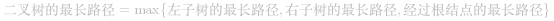
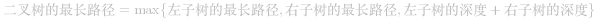

这道题需要注意的一点是：二叉树的直径（即最长路径），不一定经过根结点。下图就是不经过根结点的例子（图中黑色的结点表示最长路径的起讫点）：

 [最长路径不一定经过根结点](https://pic.leetcode-cn.com/9e94d62e1c3471c7129f614c980828d101df92e9f7712c1af9ccc192b6201dde.png)

## 解题思路：子问题定义

二叉树的解题技巧是，首先判断问题**能否划分为子问题**、**应当划分为什么样的子问题**。二叉树直径实际上就是二叉树中的最长路径，我们是可以划分出子问题的：
 
其中左子树的最长路径和右子树的最长路径是两个可以递归求解的子问题，那么经过根结点的最长路径如何计算呢？是左子树的深度加上右子树的深度。代入上面的式子得到：

 

等等。这里好像出现了两个子问题：**子树的最大直径**、**子树的最大深度**。这难道是要把树遍历两遍吗？非也，我们只需要让遍历函数返回两个值即可。

Python 通过 tuple 类型很好地支持了函数的多返回值。让我们先写一版 Python 的代码：

```Python []
# 返回二元 tuple (depth, diameter)
# depth 表示子树的最大深度，diameter 表示子树的最长路径（直径）
def traverse(root):
    if root is None:
        return (0, 0)

    left_depth, left_diam = traverse(root.left)
    right_depth, right_diam = traverse(root.right)
    # 求二叉树深度的常规方法
    depth = 1 + max(left_depth, right_depth)
    # 套用上面推导出的最长路径公式
    diam = max(left_diam, right_diam, left_depth + right_depth)
    return depth, diam

def diameterOfBinaryTree(root):
    depth, diam = traverse(root)
    return diam
```

可以看到 Python 代码写起来还是听方便的。但是很多小伙伴是用 C++ 和 Java 写算法题的，这时候就比较麻烦了。这时候就要用到另一个技巧：在二叉树遍历中使用全局变量。

## 二叉树遍历中的全局变量

乍一看来，我们的遍历函数必须返回两个值。如果我们把返回两个值的函数拆成两个函数，会出现重复递归，拖慢算法的执行时间。但仔细一看代码，似乎发现了点什么：

如果我们看函数返回的第二个值，也就是子树的直径（最长路径），我们会发现，我们所做的，不过是递归计算左右子树的最长路径，然后再通过这个计算出当前树的最长路径。**既然我们始终都是在求它的最大值，那么用一个全局变量保存它的最大值不就可以了？**

Amazing！也就是说，我们把最大直径放在函数返回值里，是让其中的某个最大值一层一层地返回上去，直到 DFS 的起点。而使用全局变量的话，则是让最大值可以直接抵达终点。

这样，我们的函数就可以只返回一个变量了。

```C++ []
int diameterOfBinaryTree(TreeNode* root) {
    int diameter = 0;
    traverse(root, diameter);
    return diameter;
}

// 返回：树的深度
// diameter 使用引用类型，效果和全局变量相同
int traverse(TreeNode* root, int& diameter) {
    if (root == nullptr) {
        return 0;
    }
    int left = traverse(root->left, diameter);
    int right = traverse(root->right, diameter);
    diameter = max(diameter, left + right);
    return 1 + max(left, right);
}
```

```Java []
int diameter;

public int diameterOfBinaryTree(TreeNode root) {
    diameter = 0;
    traverse(root);
    return diameter;
}

// 返回树的深度
int traverse(TreeNode root) {
    if (root == null) {
        return 0;
    }

    int left = traverse(root.left); // 左子树的深度
    int right = traverse(root.right); // 右子树的深度
    // 直接访问全局变量
    diameter = Math.max(diameter, left + right);
    return 1 + Math.max(left, right);
}
```

## 拓展：全局变量方法的原理与更多应用

在这道题中，全局变量计算的是路径的最大值（max）。计算 max 的方式不是一次性求出来的，而是在二叉树遍历的过程中，每出现一个值，就把这个值和全局变量比较计算，算一个最大值。最终全局变量能得到全局的最大值。

实际上这利用了 max 的性质，max 是一种**在线算法**。简单来说，在线算法就是在计算的时候，所有的输入数据以“流”的形式一个个进来，算法每次只处理一条数据，不需要保存全部的数据。

除了 max 之外，sum、all 也都属于在线算法（all 指的是 `x1 && x2 && ... && xn` 这样的计算）。可以举几个其他的二叉树题目例子：

+ 二叉树的坡度：[563. Binary Tree Tilt](https://leetcode-cn.com/problems/binary-tree-tilt/)（sum）
+ 判断平衡二叉树：[110. Balanced Binary Tree](https://leetcode-cn.com/problems/balanced-binary-tree/)（all）
+ 二叉树路径数字：[129. Sum Root to Leaf Numbers](https://leetcode-cn.com/problems/sum-root-to-leaf-numbers/)（sum）

如果你觉得本文对你有帮助，欢迎关注我的公众号《面向大象编程》，其中的《LeetCode 例题精讲》系列文章正在写作，不仅有题解，更能让你学会解题的通用思路，举一反三！

 [wechat](https://pic.leetcode-cn.com/b8f659adb680f76d11b8ab9bee37644eb22a77cc4f0d30f92d3f0bacf24061bd.jpg)

  